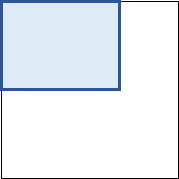

# ReducePic

フォルダ内の画像ファイルを一括でサイズ縮小します。
- ピクセルでサイズを指定すると、幅と高さのいずれか長い方が指定サイズになるように縦横比を維持して縮小し、出力先フォルダに出力します。幅と高さのいずれも指定サイズ以下の画像は何もせずそのまま出力先にコピーします。
- 割合(%)を指定すると、一律の割合で元画像のxx％になるよう縮小し、出力先フォルダに出力します。
- ファイル名、Exif情報、回転情報、ファイル更新日時は元のまま維持します。

例：2000ピクセルを指定した場合 
&nbsp;
&nbsp;
&nbsp; 
2000ピクセルに収まるようにサイズ調整する。	もともと縦横2000ピクセル以下の場合はそのまま。

### 使い方
1. ReducePic.zip を解凍して好きなところに置く。
2. ReducePic（種類：ショートカット） をダブルクリックで実行する。
3. 各項目を指定して実行ボタンで処理開始。

### 補足事項
- 割合(%)指定をすると、もともとサイズが小さい画像も一律で縮小します。過剰な解像度の大きすぎる画像ファイルを適当なサイズに落とすという本ツールの趣旨としては、ピクセル指定の方が使いやすいと思われます。割合(%)指定はその点を理解の上で使用してください。
- 縮小処理における補完方法は、高品質バイキュービック法をデフォルトとしています。設定ファイル`ReducePic.ini`をメモ帳などで開いて
`Interpolation=1`
の数字を変更すると、1:高品質バイキュービック法 2:高品質バイリニア法 3:バイキュービック法 4:バイリニア法 5:ニアレストネイバー法 に変更することができます。なお、一般的な補完方法の考え方とMicrosoftの公表資料を総合すると、この中で縮小処理に最も適しているのは高品質バイキュービック法となるので、通常は変更する必要はあまりないと思われます。
- 画像形式がJPEGの場合のみ、保存時の品質を指定することが可能ですが、通常は省略（既定の動作）で保存します。直接指定したい場合は、設定ファイル`ReducePic.ini`をメモ帳などで開いて`Quality`の数字を0～100の数値に変更することができます。なお、既定の動作の品質がどれくらいなのかは公表されていないのですが、識者の解析によれば、75であるようです。（私が実際にやってみた結果もそれに一致します）
